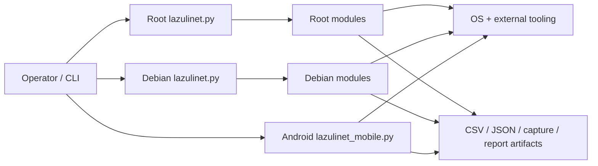
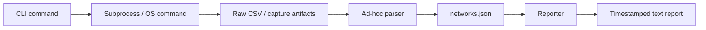
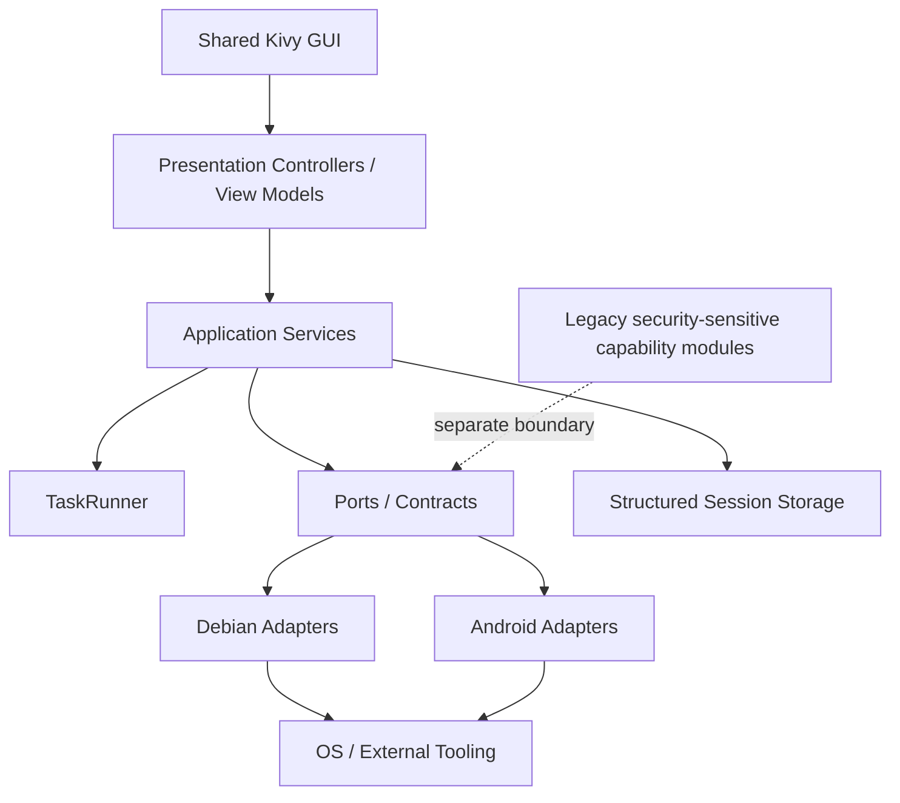

# LazuliNet Repository Architecture Map

**Snapshot:** `Lazuli-pennet-main.zip`  
**Archive revision marker:** `280c9ca1639a7e72d7f0705d5bac16e5f82d008c`  
**Review date:** 10 August 2026  
**Purpose:** establish an accurate architectural baseline before building Android and Debian graphical interfaces.

> This document maps the entire submitted repository, including security-sensitive modules, but the GUI implementation plan intentionally exposes only administrative/reconnaissance/reporting functionality. Security-sensitive legacy capability modules remain isolated from the GUI execution surface.

---

## Executive Summary

LazuliNet is currently **three related implementations rather than one application with two front ends**:

1. A root-level modular Python CLI (`lazulinet.py` + `modules/`).
2. A newer Debian-specific modular CLI (`debian/lazulinet.py` + `debian/modules/`).
3. A self-contained Android/Termux script (`android/lazulinet_mobile.py`).

The archive contains **18 files**, of which **15 are Python source files** totaling roughly **1,109 lines of Python**. Static Python compilation succeeds, but runtime and architectural inspection reveals meaningful drift between the three implementations.

The largest issue for GUI work is not visual: it is **lack of a shared application/core layer**. Process launching, privilege handling, interface state, parsing, filesystem persistence, terminal presentation, and command routing are interleaved. A GUI attached directly to these modules would inherit blocking calls, inconsistent state semantics, duplicated behavior, and shell-safety problems.

The recommended direction is to first create a small shared core with clear contracts, then place a shared **Kivy** presentation layer above it and platform adapters below it. Context7 verification of current Kivy documentation supports `ScreenManager` for multi-screen navigation and main-thread scheduling for UI updates; blocking subprocess work should be isolated from the UI thread. Context7 verification of `python-for-android` confirms Kivy packaging support and Android permission APIs, but the existing Termux/root command environment should be treated as a separate platform integration concern, not as something packaging automatically solves.

### Highest-priority findings

- **Confirmed Android runtime bug:** all non-`monitor` commands access `args.interface`, but only the `monitor` subparser defines it (`android/lazulinet_mobile.py:197`). A `scan` invocation currently raises `AttributeError` before operation dispatch.
- **Android monitor state is process-local:** `MONITOR_IFACE` is an in-memory global. A separate `stop` invocation starts with `MONITOR_IFACE = None`, so it cannot reliably undo a mode enabled by a previous process.
- **Root and Debian implementations have diverged:** the same conceptual modules exist twice with different behavior. Root/Debian source similarity ranges only about 0.39-0.68 across the duplicated core modules.
- **Scanner parsing is brittle:** root and Debian scanner code splits text on CRLF-specific blank-line delimiters while reading in universal-newline text mode, and then splits CSV fields manually on commas. This is unsuitable as a stable data API for a GUI.
- **Blocking process model:** scanning and several other operations block with `time.sleep()` and synchronous stdout loops. A GUI needs cancellable background jobs and structured progress events.
- **Configuration is hard-coded:** interface names, wordlist locations, output paths, timeouts, and privilege assumptions are scattered rather than modeled as configuration.
- **Shell construction on Android:** multiple operations build command strings with `shell=True`. Any future GUI must not pass arbitrary user-entered values into this layer. Platform adapters should use validated typed inputs and argv-style process execution wherever possible.
- **Requirements drift:** `scapy` and `colorama` are listed in `requirements.txt` but are not imported anywhere in the current repository.

---

# Part I - Fact: What Exists Today

## Repository Tree

```text
Lazuli-pennet-main/
├── .gitignore
├── README.md
├── requirements.txt
├── lazulinet.py                    # root modular CLI
├── modules/
│   ├── __init__.py
│   ├── scanner.py
│   ├── attacker.py
│   ├── cracker.py
│   └── reporter.py
├── debian/
│   ├── lazulinet.py                # Debian-specific CLI
│   └── modules/
│       ├── __init__.py
│       ├── scanner.py
│       ├── attacker.py
│       ├── cracker.py
│       ├── reporter.py
│       ├── utils.py
│       └── evil_twin.py
└── android/
    └── lazulinet_mobile.py         # monolithic Termux implementation
```

## Current Runtime Topology



There is no common domain layer beneath these entry points. The Android edition does not import the root or Debian modules at all.

## File Inventory and Ownership

| Path | Role | Approx. LOC | Main surface |
|---|---:|---:|---|
| `lazulinet.py` | Root CLI orchestration | 118 | argparse routing, fixed configuration, monitor setup |
| `modules/scanner.py` | Root discovery | 134 | subprocess scan, CSV parsing, client association, JSON output |
| `modules/attacker.py` | Root security-sensitive operations | 136 | legacy offensive capability execution |
| `modules/cracker.py` | Root security-sensitive conversion/cracking | 63 | capture conversion and external cracking process |
| `modules/reporter.py` | Root reporting | 55 | text report from `networks.json` + capture inventory |
| `debian/lazulinet.py` | Debian CLI orchestration | 113 | monitor/scan/attack/crack/report routing |
| `debian/modules/scanner.py` | Debian discovery | 67 | simplified scan/parser/JSON flow |
| `debian/modules/attacker.py` | Debian security-sensitive operations | 66 | legacy offensive capability execution |
| `debian/modules/cracker.py` | Debian security-sensitive conversion/cracking | 31 | compact external process wrapper |
| `debian/modules/reporter.py` | Debian reporting | 36 | simplified text report |
| `debian/modules/utils.py` | Debian platform utilities | 40 | banner, root check, interface detection, mode switching |
| `debian/modules/evil_twin.py` | Debian security-sensitive capability | 29 | legacy rogue-AP process wrapper |
| `android/lazulinet_mobile.py` | Android/Termux implementation | 220 | privilege bridge, interface management, discovery, persistence, legacy capabilities, CLI |
| `requirements.txt` | Python dependency declaration | 2 | `scapy`, `colorama` |
| `README.md` | User-facing quick start | 37 | feature summary and CLI examples |

## Entry Points

### Root CLI: `lazulinet.py`

Responsibilities:

- defines fixed interface, wordlist, and output-directory constants;
- configures `argparse` subcommands;
- switches the fixed interface to monitor mode before root scan/attack flows;
- instantiates root `Scanner`, `Attacker`, `Cracker`, and `Reporter` classes;
- prints terminal-oriented feedback.

Commands represented by the root launcher are `scan`, `attack`, `crack`, and `report`.

Architecturally, the root launcher contains both **presentation concerns** (terminal messages and CLI flags) and **platform concerns** (Linux wireless-mode changes). This is one of the seams that should be split before GUI integration.

### Debian CLI: `debian/lazulinet.py`

Responsibilities:

- adds an explicit `monitor` command;
- allows per-command wireless-interface selection for monitor/scan/attack;
- imports the Debian-specific module set;
- adds the Debian-only `EvilTwin` module;
- delegates mode switching to `debian/modules/utils.py`.

Important divergence: unlike the root launcher, Debian `scan()` and `attack()` do **not** automatically call `ensure_monitor_mode()`. The operator is expected to manage mode separately.

The imports `check_root()` and `detect_interface()` exist but are not used by the current Debian launcher.

### Android CLI: `android/lazulinet_mobile.py`

This is not a thin front end over a shared core. It reimplements all major behaviors in a single file:

- root command execution through `tsu`;
- root detection;
- interface detection;
- monitor-mode enable/disable;
- network discovery and CSV parsing;
- JSON persistence;
- several legacy security-sensitive operations;
- CLI parser and dispatch.

The Android script uses Android/Termux-specific paths:

- default wireless interface: `wlan0`;
- wordlist path under `/sdcard/wordlists/`;
- output directory `/sdcard/LazuliNet_Output`.

This edition is therefore a **forked implementation**, not merely a platform adapter.

---

## Module-Level Map

### Scanner

**Root:** `modules/scanner.py`  
**Debian:** `debian/modules/scanner.py`  
**Android:** inline `scan_networks()`

Common responsibilities:

1. start an external Wi-Fi discovery process;
2. wait for a fixed duration;
3. stop the process;
4. parse a generated CSV artifact;
5. print a terminal table;
6. persist normalized-looking data to `networks.json`.

Differences:

- Root scanner attempts to parse associated client stations and attach client MACs to networks.
- Debian scanner removed client-station parsing and always initializes `clients` to an empty list.
- Android parser scans line-by-line until the station section and does not model clients.
- Root and Debian scanners use manual comma splitting rather than Python's `csv` module.
- Root scanner does not ensure its output directory exists before launching its scan process; Debian and Android do.
- Scanner instances do not reset `self.networks` at the beginning of `run()`, so reusing one instance can accumulate previous results.

### Reporter

**Root:** `modules/reporter.py`  
**Debian:** `debian/modules/reporter.py`

Both read `networks.json`, enumerate capture-like artifacts, and create a timestamped text file.

Divergence:

- Root report includes client counts/client MACs when available.
- Debian report omits client data.
- Both assume the output directory already exists. A report-only first run can fail if no earlier operation created the directory.
- Reporting is file/terminal coupled rather than returning a report model that multiple front ends can render.

### Interface / Privilege Utilities

**Root:** embedded in `lazulinet.py`  
**Debian:** `debian/modules/utils.py`  
**Android:** inline functions in `lazulinet_mobile.py`

The same conceptual responsibilities are implemented three times:

- interface discovery;
- privilege/root availability;
- monitor-mode detection/change;
- restoration to managed mode.

The differences are substantial enough that this should become a formal platform interface rather than continued copy/paste.

### Security-Sensitive Legacy Modules

The repository also includes modules for disruption, credential-oriented capture/cracking, WPS, PMKID, and rogue-AP behavior. These are part of the repository map and must be accounted for in dependency boundaries, but they should **not be wired to executable GUI controls** in the planned general GUI shell.

Recommended treatment:

- preserve them as explicitly named legacy capability modules if repository compatibility is required;
- keep their imports out of the default GUI service registry;
- do not expose a generic “execute arbitrary operation” adapter from the GUI;
- optionally expose read-only metadata such as “module present / unavailable / requires authorization” for repository completeness.

---

## Data and Artifact Flow

Current operation flow is filesystem-centric:



### Current artifacts

| Artifact | Producer | Consumer | Notes |
|---|---|---|---|
| `scan_<timestamp>-01.csv` | scanner process | scanner parser | raw discovery source |
| `networks.json` | scanner | reporter / future GUI | overwritten each scan; no session history |
| capture-oriented files | legacy security modules | cracker/reporter | security-sensitive artifacts |
| `report_<timestamp>.txt` | reporter | terminal/user | plain text only |
| temporary target/config files under `/tmp` | legacy modules | external tools | fixed names may collide across concurrent jobs |

The GUI should not use terminal stdout or raw CSV as its primary state source. It needs a normalized session model and an event stream.

---

## Configuration Model Today

Configuration is implicit and scattered.

| Concern | Root | Debian | Android |
|---|---|---|---|
| Default interface | hard-coded USB-like interface | same hard-coded interface | `wlan0`, plus basic detection |
| Interface override | no | yes for selected commands | intended, but currently broken outside `monitor` |
| Output directory | `~/lazulinet/output` | project-local `debian/output` | `/sdcard/LazuliNet_Output` |
| Wordlist | `/usr/share/wordlists/rockyou.txt` | same | `/sdcard/wordlists/rockyou.txt` |
| Privilege mechanism | `sudo` inside operations | `sudo` inside operations | `tsu` wrapper + fallback |
| Scan duration | CLI option | CLI option | CLI option |
| Persistent settings | none | none | none |

A GUI requires a real settings object and platform defaults, not constants distributed across entry points.

---

## External Dependency Boundary

The application is primarily a Python orchestrator around operating-system tools. Observed external command families include:

- Linux interface inspection/configuration utilities;
- privilege elevation (`sudo` on Debian, `tsu` on Android/Termux);
- wireless discovery/capture tooling;
- capture conversion tooling;
- optional cracking tooling;
- Debian-only AP-hosting tooling.

This boundary is currently called directly from UI/CLI-facing code. It should be isolated behind typed adapters before GUI work.

### Python requirements

`requirements.txt` contains:

- `scapy>=2.4.5`
- `colorama>=0.4.6`

Neither package is imported by the submitted Python source. This suggests dependency drift or incomplete planned features.

---

# Part II - Insight: Architectural Problems and Confirmed Defects

## 1. Three Implementations Are Drifting

The root and Debian versions duplicate the same conceptual modules but do not preserve behavior. Approximate whole-file similarity from this snapshot:

| Duplicated module | Root vs Debian similarity |
|---|---:|
| `scanner.py` | ~0.58 |
| `attacker.py` | ~0.39 |
| `cracker.py` | ~0.64 |
| `reporter.py` | ~0.68 |

This is enough divergence that fixing one path will not reliably fix the others. The Android edition adds a third independent implementation.

**GUI implication:** do not build two GUIs by importing the Debian and Android code separately. First converge shared semantics.

## 2. Confirmed Android `argparse` Failure

At `android/lazulinet_mobile.py:197`:

```python
INTERFACE = detect_interface() if not args.interface else args.interface
```

Only the `monitor` subparser defines `--interface`. Other subcommands do not create the `interface` attribute. A direct execution test of `scan --time 0` fails with:

```text
AttributeError: 'Namespace' object has no attribute 'interface'
```

This is a confirmed runtime defect, not a hypothetical issue.

**Fix direction:** define interface selection consistently at the top-level or on every relevant subparser, and do not let view/controller code reach raw `argparse.Namespace` fields directly.

## 3. Android Monitor-State Lifecycle Is Not Persistent

`MONITOR_IFACE` is initialized to `None` whenever the Python process starts. Enabling monitor mode in one invocation does not preserve that variable for a later process. Therefore a later `stop` invocation cannot rely on it.

**Fix direction:** platform state must be discovered from the operating system each time, not inferred from a process-local global. The GUI should maintain a view model for convenience but treat OS state as authoritative.

## 4. Scanner Parsing Is Not a Stable Data Layer

Root/Debian use:

```python
sections = content.split("\r\n\r\n")
```

but the file is opened in normal Python text mode, where newline translation can normalize CRLF sequences. This can prevent the intended network/client section split. Both variants also use `line.split(",")`, which is not a CSV parser and can mis-handle quoted fields containing commas.

**Fix direction:** use `csv` with explicit schema normalization, and make parser tests from recorded fixtures. Parsing should return typed `Network` and `Client` objects with no printing or filesystem writing.

## 5. Blocking Work Is Mixed with Presentation

Examples include fixed sleeps, synchronous process stdout loops, and terminal printing from service classes.

A GUI main thread cannot own these operations without freezing.

Context7-verified Kivy guidance is directly relevant: UI/OpenGL work should be performed on the main thread; background work should marshal UI changes back through Kivy's scheduling/main-thread mechanism.

**Fix direction:** introduce a `TaskRunner` that provides:

- background execution;
- cancellation;
- timeouts;
- process lifecycle ownership;
- structured log/progress events;
- terminal-independent return values.

## 6. Error Handling Is Too Opaque for a GUI

Android `run_root()` catches all exceptions and returns empty strings. Several process launches suppress stdout/stderr entirely. Other areas test only for artifact existence.

A terminal operator may infer failure from context; a GUI needs typed error states.

**Fix direction:** standardize errors such as:

- `PrivilegeUnavailable`
- `InterfaceNotFound`
- `UnsupportedMonitorMode`
- `DependencyMissing`
- `ProcessTimeout`
- `ProcessFailed`
- `ParseError`
- `StorageError`

## 7. Shell-Safety Boundary Needs Redesign

Android builds multiple command strings and uses `shell=True`. Values such as interface names, channels, identifiers, and paths should never flow directly from future GUI text inputs into shell command strings.

**Fix direction:**

- use argv-style process invocation where possible;
- validate MAC/BSSID formats, channel ranges, interface identifiers, and filesystem paths;
- centralize command construction inside platform adapters;
- never expose an arbitrary shell-command field in the GUI.

## 8. Output Directory Creation Is Inconsistent

- Debian scanner and attacker create the output directory.
- Android scan/security functions create it.
- Root scanner does not create it before launch.
- Reporters do not create it before writing.

**Fix direction:** a single `ArtifactRepository` should own storage-root creation and session directories.

## 9. Current Persistence Overwrites Scan State

Every scan writes `networks.json` to the same location. This loses session identity and makes concurrent/background scans unsafe.

**Fix direction:** use session directories or a small SQLite/JSON session store, for example:

```text
data/
└── sessions/
    └── 2026-08-10T21-30-44Z_<id>/
        ├── session.json
        ├── networks.json
        ├── raw/
        └── logs/
```

## 10. Documentation and Ignore Rules Need Cleanup

- README formatting appears to leave a Debian quick-start code block unclosed before the Android section.
- `.gitignore` contains `.22000`, which matches a literal filename rather than the more likely intended `*.22000` pattern.
- Several imports are unused.

These are small, but they indicate that the repository needs a baseline cleanup pass before packaging.

---

# Part III - Action: Target Architecture Before GUI

## Architectural Goal

Create **one shared application** with:

- a shared domain/application core;
- a platform-neutral GUI presentation layer;
- Debian and Android adapters;
- an optional CLI that calls the same application services;
- isolated legacy security-sensitive modules outside the default GUI execution registry.

## Recommended Target Topology



### Why Kivy is the best current candidate

For this repository specifically, Kivy minimizes language duplication because the existing code is Python. Context7-verified current documentation supports:

- cross-platform desktop/mobile use;
- `ScreenManager` for multiple application screens;
- main-thread scheduling for safe UI updates from asynchronous/background work.

`python-for-android` documentation also confirms Kivy/SDL2 packaging and Android permission APIs.

### Important Android distinction

The current Android edition depends on a Termux/root environment and external binaries. A packaged Kivy APK is an independent Android application environment. Therefore the architecture should **not assume** that packaging the Python source automatically gives the APK access to the current Termux command/tool paths.

Treat Android execution as one of two explicit strategies:

1. **Termux-backed bridge** - GUI communicates with a controlled local service/bridge that owns the existing rooted tooling environment.
2. **Packaged native bridge** - required native/tool dependencies are deliberately packaged or accessed through an Android-specific integration layer.

The UI code can be shared in either case; the platform adapter is what changes.

---

## Proposed Package Structure

```text
lazulinet/
├── pyproject.toml
├── src/lazulinet/
│   ├── domain/
│   │   ├── models.py
│   │   ├── errors.py
│   │   └── capabilities.py
│   ├── application/
│   │   ├── interface_service.py
│   │   ├── discovery_service.py
│   │   ├── report_service.py
│   │   ├── artifact_service.py
│   │   └── task_runner.py
│   ├── ports/
│   │   ├── interface_adapter.py
│   │   ├── discovery_adapter.py
│   │   ├── privilege_adapter.py
│   │   └── storage_adapter.py
│   ├── platform/
│   │   ├── debian/
│   │   │   ├── interface.py
│   │   │   ├── discovery.py
│   │   │   └── privilege.py
│   │   └── android/
│   │       ├── interface.py
│   │       ├── discovery.py
│   │       └── privilege.py
│   ├── presentation/
│   │   ├── app.py
│   │   ├── controllers/
│   │   ├── screens/
│   │   └── widgets/
│   ├── cli/
│   │   └── main.py
│   └── legacy/
│       └── security_capabilities/
├── tests/
│   ├── fixtures/
│   ├── unit/
│   └── integration/
└── data/
```

This structure is intentionally more layered than the current code but remains small enough for a 1,100-line project.

---

## Core Domain Models

The GUI should not pass dictionaries and `argparse.Namespace` objects across layers. Minimum models:

### `WirelessInterface`

```text
name
mac_address
mode: managed | monitor | unknown
is_up
supports_monitor
platform_metadata
```

### `NetworkObservation`

```text
bssid
essid
channel
privacy
cipher
auth
signal_power
beacons
data_frames
clients[]
first_seen
last_seen
```

### `ScanSession`

```text
id
started_at
ended_at
interface
channel_filter
target_filter
status
networks[]
raw_artifacts[]
log_path
```

### `TaskState`

```text
id
kind
state: queued | running | cancelling | completed | failed
progress
started_at
ended_at
message
error
```

These objects create a stable contract for both CLI and GUI.

---

## Platform Contracts

### `InterfaceAdapter`

Responsibilities:

- list interfaces;
- inspect current interface state;
- request mode change;
- restore managed mode;
- return explicit success/failure objects.

No terminal printing.

### `DiscoveryAdapter`

Responsibilities:

- start a discovery process;
- expose process identity;
- stop/cancel discovery;
- return raw artifact location and/or parsed observations.

### `PrivilegeAdapter`

Responsibilities:

- report privilege availability;
- describe platform mechanism;
- perform narrowly scoped privileged operations.

It should not accept arbitrary command strings.

### `StorageAdapter`

Responsibilities:

- create session directories;
- persist normalized data;
- enumerate prior sessions;
- read/write logs and reports;
- manage export destinations.

---

## Background Task and Event Model

Recommended safe GUI flow:


The task runner should emit events such as:

```text
TaskStarted
LogLine
ProgressChanged
ArtifactCreated
ObservationBatch
TaskCancelled
TaskFailed
TaskCompleted
```

This is much cleaner than scraping `print()` output.

---

# GUI Information Architecture

## Shared Navigation

Recommended first version:

1. **Dashboard**
2. **Interfaces**
3. **Discovery / Scan**
4. **Networks**
5. **Sessions**
6. **Reports**
7. **Logs**
8. **Settings**
9. **System / Dependencies**

Security-sensitive legacy modules should not receive executable primary navigation actions in this shell.

## Dashboard

Show:

- platform (`Debian` / `Android`);
- privilege status;
- active wireless interface;
- current mode;
- last scan timestamp;
- network count;
- active background task;
- storage location;
- dependency health.

## Interfaces Screen

Functions:

- enumerate adapters;
- show MAC/name/mode/state;
- choose active adapter;
- request monitor/managed mode transition;
- re-check capabilities/state;
- display explicit errors.

## Discovery Screen

Functions:

- duration control;
- optional channel filter;
- start/cancel scan;
- live status/progress;
- live normalized observations when possible;
- open completed session.

## Networks Screen

Table/cards:

- ESSID;
- BSSID;
- channel;
- privacy/cipher/auth;
- signal;
- associated client count when available;
- first/last seen;
- session source.

Filters:

- SSID search;
- channel;
- encryption;
- signal range;
- hidden/visible.

## Sessions Screen

Show historical scans instead of overwriting `networks.json`.

Actions:

- open;
- compare;
- export normalized data;
- generate report;
- delete local session.

## Reports Screen

Move reporting from “write a text file and print it” to a report model that can render:

- in-app summary;
- TXT;
- JSON;
- later HTML/PDF if desired.

## Logs Screen

Every task should have structured logs with level, timestamp, component, and message. This is especially important on Android where silent exception handling currently makes troubleshooting difficult.

## System / Dependencies Screen

Display capability checks rather than discovering missing tools at the moment a user clicks an action.

Examples:

- Python/runtime version;
- wireless interface support;
- privilege status;
- platform adapter status;
- required discovery utility present/missing;
- writable storage path;
- Android bridge status.

---

# Debian and Android Adapter Differences

| Area | Debian | Android |
|---|---|---|
| Privilege | `sudo`-based | rooted/Termux bridge today |
| Interface discovery | `iw`/Linux | rooted Linux-style commands within Android environment |
| Default storage | app/user data path | Android application/storage policy |
| Packaging | normal Python app / desktop package | Kivy + python-for-android or controlled Termux-backed architecture |
| Background process management | standard POSIX subprocess | depends on Android bridge/runtime |
| Permissions | Unix privilege + device access | Android runtime permissions + root/tool bridge where needed |
| UI form factor | desktop/tablet | touch-first phone/tablet |

The GUI presentation layer can share most screens, but platform services should be dependency-injected.

---

# Refactor Plan

## Phase 0 - Baseline and Tests

Before visual work:

- preserve this ZIP/commit marker as the baseline;
- add parser fixtures from representative scan CSV files;
- add unit tests for interface parsing and storage;
- add command-router tests that do not execute system tools;
- add a smoke test for every CLI subcommand parser;
- fix README code fencing and ignore rules.

## Phase 1 - Extract Shared Safe Core

Extract:

- models;
- storage/session repository;
- scanner parser;
- interface state model;
- structured errors;
- reporting model.

No GUI yet.

## Phase 2 - Platform Adapters

Implement:

- Debian interface/privilege/discovery adapter;
- Android Termux/root adapter;
- dependency/capability checks;
- argv-safe process abstraction;
- process cancellation.

## Phase 3 - Shared TaskRunner

Replace `time.sleep()`-driven orchestration in UI-facing safe services with managed jobs.

Required tests:

- start;
- cancel;
- timeout;
- process failure;
- parser failure;
- UI event delivery.

## Phase 4 - Debian GUI

Build Kivy shell and validate:

- dashboard;
- interface management;
- discovery;
- networks;
- sessions;
- reports;
- logs/settings.

Desktop is the easier environment for validating the shared core and UI state model.

## Phase 5 - Android GUI

Reuse Kivy screens/controllers and bind Android adapters.

Explicitly decide whether Android v1 is:

- Termux-backed; or
- a packaged APK with its own platform bridge.

Do not mix those assumptions.

## Phase 6 - CLI Convergence

Replace root and Debian duplicate CLIs with one CLI calling the same application services as the GUI. Keep platform selection explicit.

## Phase 7 - Remove Duplication

After behavior parity is verified:

- retire root duplicate modules;
- retire Debian duplicate modules;
- shrink Android monolith to adapter/bootstrap code;
- keep legacy security-sensitive modules isolated from the default GUI registry.

---

# Prioritized Defect / Debt Register

| Priority | Finding | Impact | Recommended action |
|---|---|---|---|
| P0 | Android `args.interface` crash | most Android commands fail before dispatch | normalize parser/config handling |
| P0 | GUI-unfriendly blocking process model | UI freeze/cancellation failure | introduce TaskRunner before GUI wiring |
| P0 | shell-string execution in Android layer | unsafe GUI input boundary | typed validation + argv-safe adapter |
| P1 | duplicate root/Debian/Android logic | fixes drift; inconsistent behavior | shared core + platform adapters |
| P1 | CRLF/manual CSV parser | incorrect/incomplete observations | use `csv` module + fixtures |
| P1 | monitor state stored as process global on Android | stop/state UI inaccurate | query OS state each session |
| P1 | hard-coded interface/paths | poor portability | settings + platform defaults |
| P1 | stdout-as-API | hard to build GUI state | structured events/results |
| P2 | output dir creation inconsistent | first-run failures | storage repository owns dirs |
| P2 | `networks.json` overwritten | no session history/concurrency | session-scoped persistence |
| P2 | missing dependency preflight | opaque runtime failures | System/Capabilities service |
| P2 | unused Python requirements | package bloat/confusion | remove or implement intentionally |
| P3 | README code fence + `.gitignore` pattern | documentation/repo hygiene | cleanup baseline |

---

# Recommended First Implementation Slice

The best first slice is deliberately narrow and proves the architecture:

```text
Shared models
  +
Storage/session repository
  +
Debian InterfaceAdapter
  +
Debian DiscoveryAdapter
  +
TaskRunner
  +
Kivy Dashboard / Interfaces / Discovery / Networks
```

Success criteria:

- GUI never calls `subprocess` directly;
- GUI never parses raw CSV;
- GUI never depends on `print()` output;
- scan can be cancelled without freezing the UI;
- interface mode is read from actual platform state;
- each scan is a session with its own artifacts;
- the same application-service tests can later run against Android adapters.

Once this slice is stable, Android becomes an adapter/packaging problem rather than a second application rewrite.

---

# Appendix A - Function / Class Index

## Root

### `lazulinet.py`
- `banner()`
- `ensure_monitor_mode()`
- `scan(args)`
- `attack(args)`
- `crack(args)`
- `report(args)`
- `main()`

### `modules/scanner.py`
- `Scanner.__init__()`
- `Scanner.run()`
- `Scanner._parse_csv()`
- `Scanner._display_results()`

### `modules/attacker.py`
- `Attacker.__init__()`
- security-sensitive legacy capability methods

### `modules/cracker.py`
- `Cracker.__init__()`
- security-sensitive legacy conversion/cracking method

### `modules/reporter.py`
- `Reporter.__init__()`
- `Reporter.generate()`

## Debian

### `debian/lazulinet.py`
- `scan(args)`
- `attack(args)`
- `crack(args)`
- `report(args)`
- `monitor_cmd(args)`
- `main()`

### `debian/modules/utils.py`
- `banner()`
- `check_root()`
- `detect_interface()`
- `ensure_monitor_mode(interface)`
- `restore_managed_mode(interface)`

### `debian/modules/scanner.py`
- `Scanner.__init__()`
- `Scanner.run()`
- `Scanner._parse_csv()`
- `Scanner._display_results()`

### `debian/modules/attacker.py`
- `Attacker.__init__()`
- security-sensitive legacy capability methods

### `debian/modules/cracker.py`
- `Cracker.__init__()`
- security-sensitive legacy conversion/cracking method

### `debian/modules/reporter.py`
- `Reporter.__init__()`
- `Reporter.generate()`

### `debian/modules/evil_twin.py`
- `EvilTwin.__init__()`
- security-sensitive legacy capability method

## Android

### `android/lazulinet_mobile.py`
- `run_root(cmd, timeout=30)`
- `check_root()`
- `detect_interface()`
- `enable_monitor_mode(iface)`
- `disable_monitor_mode(mon_iface)`
- `scan_networks(duration=30, target_channel=None)`
- security-sensitive legacy capability functions
- `main()`

---

# Appendix B - Validation Performed

This architecture map used:

- full archive inventory;
- AST-based import/function/class inventory;
- Python `compileall` syntax validation (passes);
- root-vs-Debian source diffs;
- duplicate-file similarity checks;
- static external-command/dependency inventory;
- direct reproduction of the Android non-monitor `argparse` crash;
- Context7 lookup of current Kivy and python-for-android documentation;
- Develoop's **Fact → Insight → Action** structure to separate repository facts, architectural interpretation, and recommended implementation steps.

No external Wi-Fi operations or security-sensitive runtime actions were executed during this review.

---

# Bottom Line

The current code is a workable CLI prototype family, but it is **not yet a clean two-platform application architecture**. The GUI should not be bolted directly onto the existing Debian modules and Android monolith. The strongest path is:

**normalize the core → isolate platform adapters → add cancellable task execution → build one shared Kivy GUI → bind Debian first → bind Android through an explicit platform bridge.**

That preserves the useful code already present while preventing the GUI from becoming a fourth divergent implementation.
